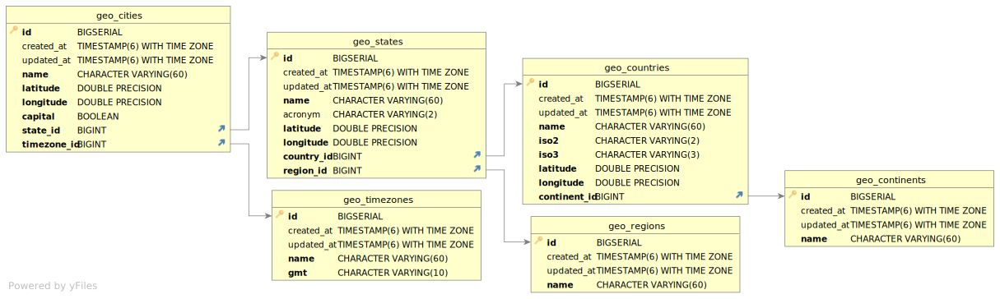

<h1 align="center">Geo SQL Database</h1>

- A curated collection of Continents, Countries, States, Regions, Cities, Timezones using PostgreSQL.

| Table      | Rows |
| ---------- | ---: |
| Continents |    8 |
| Timezones  |  418 |
| Countries  |  244 |
| Regions    |    5 |
| States     |   27 |
| Cities     | 5570 |

## ER Diagram

    

## Contributing

- Anyone is free to open up pull requests for missing data, they will be merged ASAP.

## Contributors

## License

Copyright © 2023 [raulaguila](https://github.com/raulaguila).
This project is [MIT](../LICENSE) licensed.
